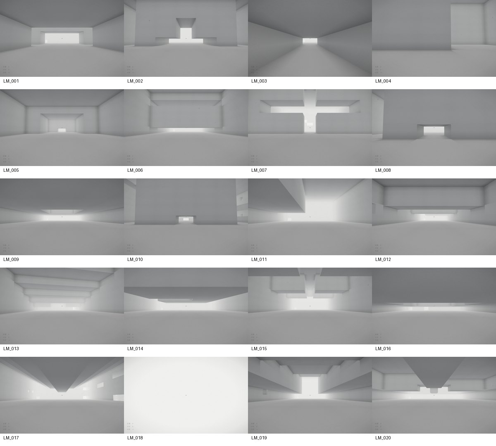
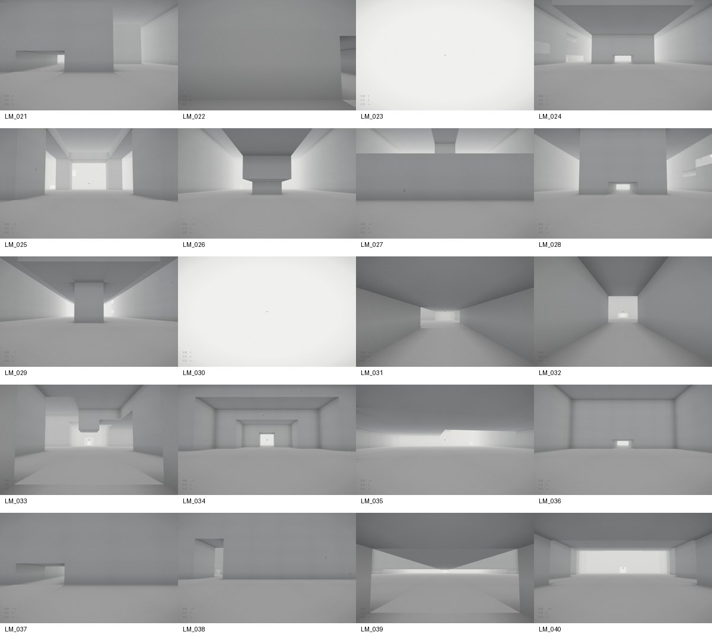
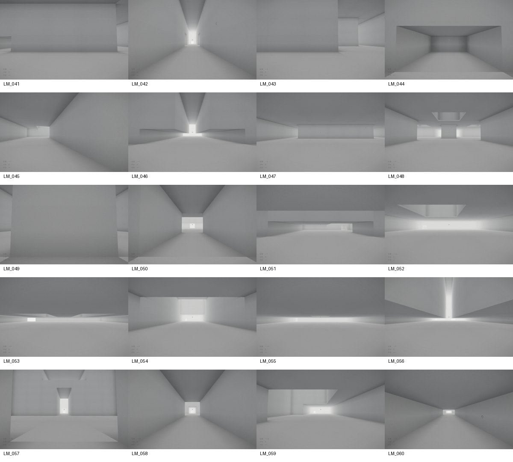
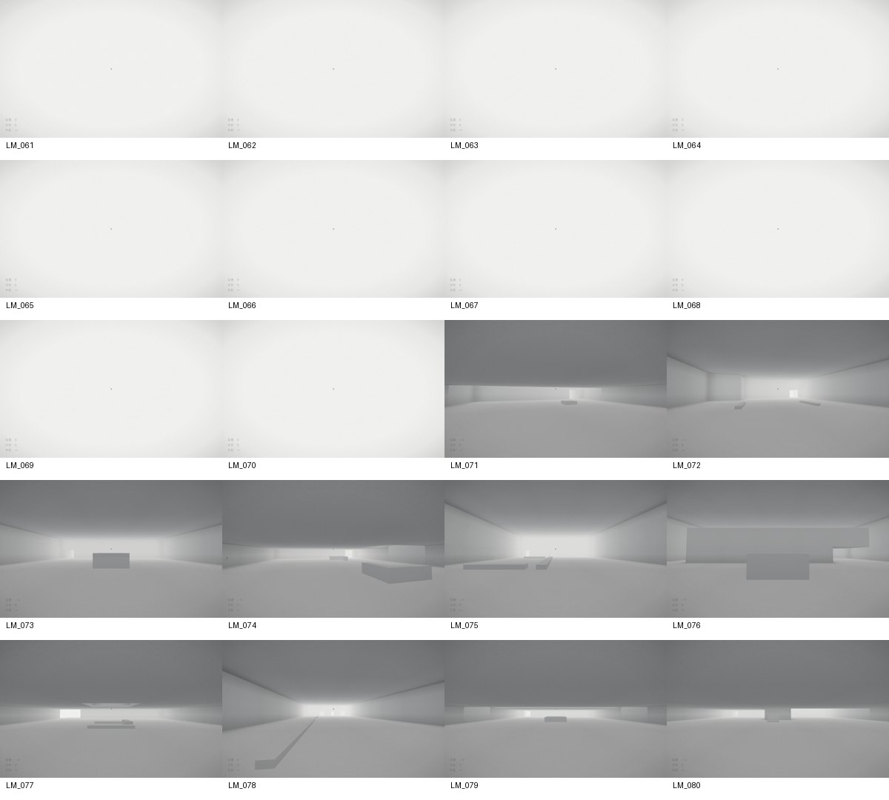
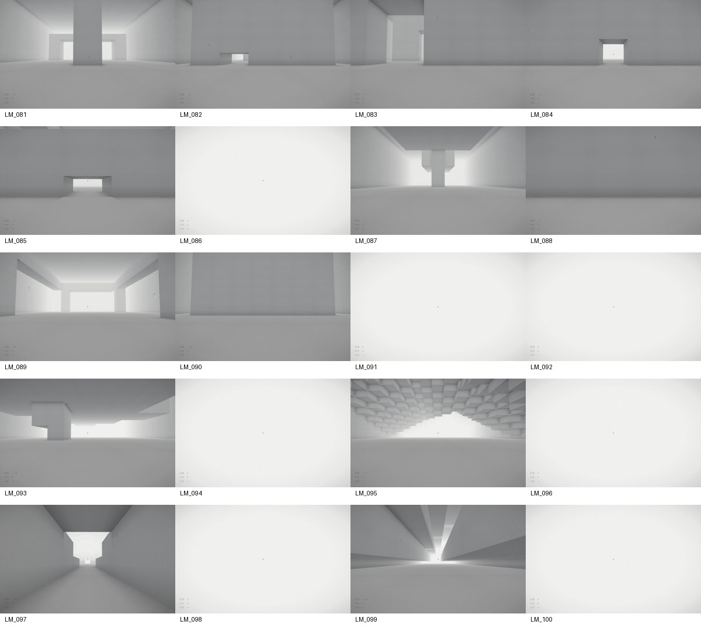

# ランドマーク追加の検証結果

2026-09-07 / Windows / Node 24.19.0 / Chrome + Playwright / Three.js r169。
比較元は `0f4fda4`。詳細な定義は [100種類の設計一覧](landmarks-100.md)。

## 結果

| 検証 | 結果 |
|---|---|
| 静的ビルド | 成功。構文検査、100レシピのコンパイル、12ファイルの配布物とSHA256一覧 |
| ID・形状・rarity | LM_001〜LM_100、重複IDなし、100種類の異なる形状シグネチャ、全選択区間を検査 |
| 自然生成 | 数値seed 12345、粗い格子半径480で全100種類を検出。デバッグ専用の形状注入なし |
| 既存形状の保全 | 元コミットの実コードと6seedで比較。216配置・142,693セルが完全一致 |
| world統合 | 全106種類について、出入口、通れる寸法、往復到達性、形状再生成を確認 |
| 通常迷路の回帰 | 8seed。帰還不能地点0、狭すぎる通路0、低すぎる通路0、塞がった口0 |
| 物理歩行 | 新規100種類の入口間を、実際のmeshとカプセル衝突で往復 |
| 高低差 | 14種類にある計16本の階段を、実際のカプセルで昇降 |
| チャンク境界 | 全106種類の占有範囲をメッシュ化。代表チャンクを隣接チャンクの逆順生成後に比較し一致 |
| 支持・空間 | 全レシピの空洞連結、地上経路連結、岩塊の床・天井・岩盤への接続を検査 |
| 最終形状修正 | 支持を調整した20種類の物理・geometry検証とブラウザ画像を再確認 |
| 遠方LOD | 代表5種類で通常精度と低精度の衝突三角形が完全一致。描画頂点数は増加しない |
| ブラウザ描画 | 全100種類を実ゲームで生成し画像取得。pageerror 0 |
| ゲーム操作回帰 | 3seed × 6項目、18/18成功。階段、落下、壁の印、扉、長距離歩行、再生成 |
| 縦長画面 | 390×844で既存大広間・小型・巨大2種類・既存大広間への帰還を確認。pageerror 0 |

## 負荷と限界

全体を高精度で検証した際の1チャンク最大値は、既存6種類が32,852頂点 / 4,200衝突三角形、
新規100種類が32,992頂点 / 4,426衝突三角形。
描画細分化と衝突面は分離しているため、陰影用の細かい分割が衝突三角形を増やさない。

通常時の読み込みは45チャンク。全100種類の入口で測った最大は107チャンク。
巨大構造だけ、自分の占有領域に必要なチャンクを追加する。追加領域は遠方LODを使用。
6msはキューが次の生成を開始するための予算であり、1チャンクの処理時間の上限ではない。

最終LOD実装後の縦長画面での描画スナップショット:

| 場所 | 読込チャンク | 遠方LOD | 描画三角形 | GPU geometry |
|---|---:|---:|---:|---:|
| cathedral | 45 | 0 | 136,142 | 23 |
| LM_071 | 45 | 0 | 319,532 | 36 |
| LM_091 | 107 | 62 | 223,184 | 84 |
| LM_100 | 106 | 68 | 258,144 | 99 |
| cathedralへ帰還 | 45 | 0 | 136,142 | 23 |

描画数はカメラに依存する。GPU geometryは読み込み総数ではなく、実際にGPUへ送られた数。
巨大構造を往復したあと、同じ場所のgeometry数と描画数が元に戻った。
既存の共有material、frustum culling、チャンクのdispose、衝突登録解除を継承している。

ブラウザ検証はソフトウェアGPUのSwiftShaderで実施。観測されたフレーム間隔は約233〜417msで、
実機GPUのFPSを代表しない。スマートフォン実機のFPSは未測定であり、動作保証とはしない。
また、seed12345の全種類と複数seedの通常世界を検証しているが、全32bit seedを総当たりしたわけではない。

## 実際の入口からの画像

下は各IDの入口から中央を向いた画像。内部・裏側・上段の探索経路は別途物理テストで検証。
大きい天井や内部の構造は、近づく・回る・上を向くことでさらに見えてくる。







## 再実行

```sh
npm install
npm run build
npm test
npm run test:landmarks
npm run test:geometry
node tools/legacy-landmarks.mjs
npm run test:browser
npm run review:landmarks
```

Chromeが別の場所にある場合は `WB_CHROME` に実行ファイルを指定する。
`WB_MOBILE=1` は縦長ビューポート、`WB_PORT` は画像検証サーバのポートを指定する。
ブラウザ試験は同時に多数走らせるとホストのメモリ・ソフトウェアGPUを競合するため、順に実行する。
ヘッドレスでマウス捕捉の権限は試験対象外とし、移動・視点は既存の `__wb` テスト用APIで制御する。


## スマートフォン操作の追加検証

- `node tools/build.mjs`: 成功。タッチ操作モジュールを含む13ファイル。
- `node tools/catalog.mjs`: 新規100種類すべて自然生成可能、ID・rarity検査成功。
- `node tools/touch.mjs`: Chromeの390×844 / 844×390タッチ環境で成功。
  Pointer Lockなしで開始、左スティックの前後左右移動、前へ最大に倒した際の物理ダッシュ、移動と右半分の視点操作、独立した指の解放、キャンセル、ジャンプ入力、blur、停止・再開、回転時リセットを検査。実行時例外0。
- PCのマウス主体環境でタッチUIが出ず、既存の操作案内が表示されることも確認。
- 実機のSafari/AndroidブラウザやスマートフォンのFPSは未測定。

生成・geometry・collisionの実装はランドマーク検証時から変更していない。
入力は既存の加速・速度上限・カプセル衝突へ渡し、タッチ専用の位置移動は行わない。
- タッチ統合後の `node tools/check.mjs`: 3seed × 6項目、18/18成功（階段・落下・印・扉・長距離歩行・seed再生成）。
